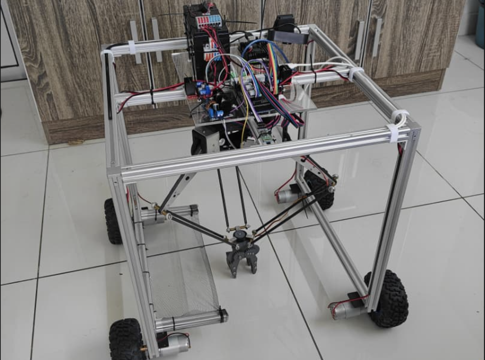
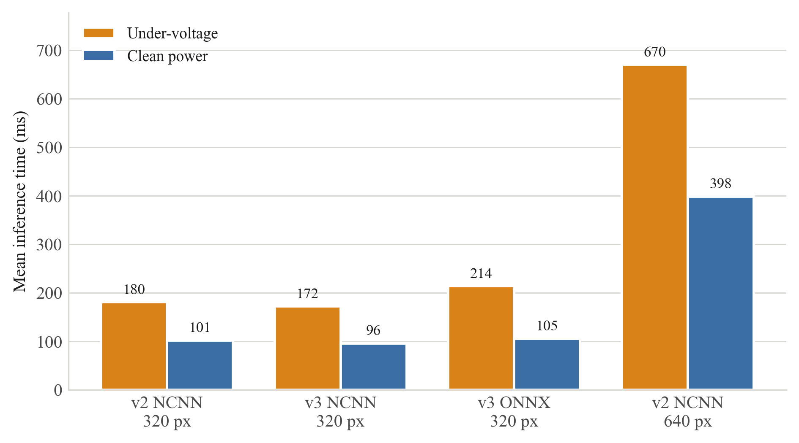
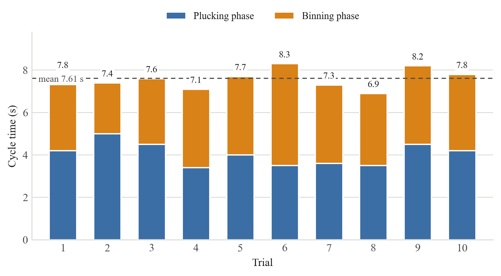
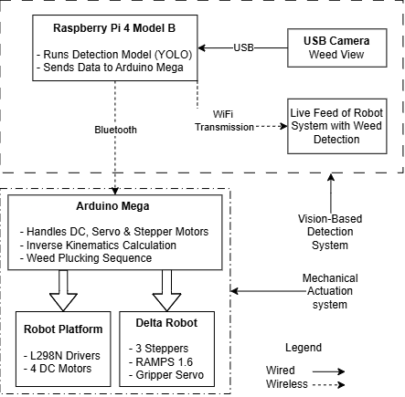
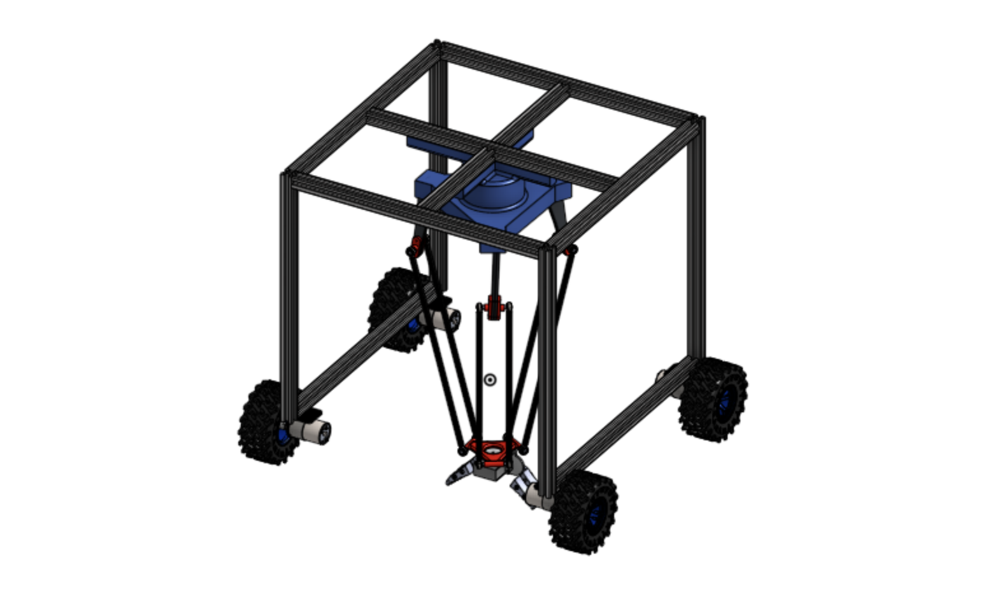
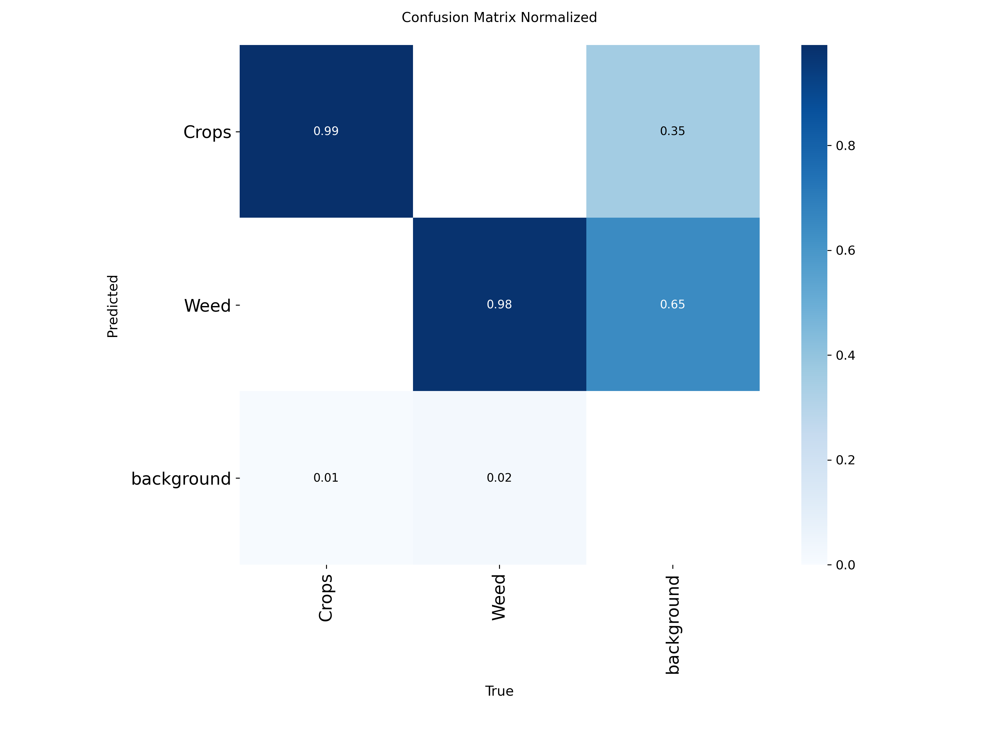
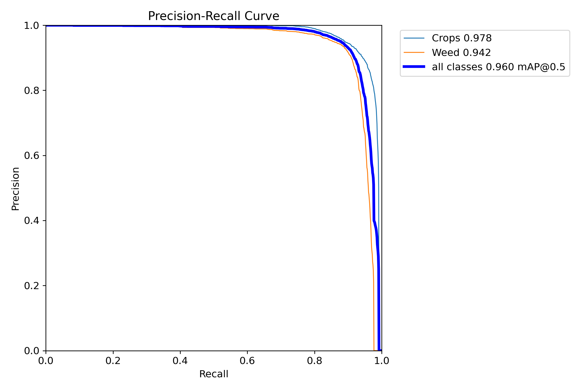

# Robotic Weed Control System

An autonomous weed-picking robot: a downward-facing camera drives a YOLO
detector on a Raspberry Pi 4, which converts pixels to millimetres and
commands a delta arm over Bluetooth to pluck the weed and drop it in a bin.

The whole thing runs on commodity hardware — a Pi 4, an Arduino Mega, and
less than **RM 2000 (~USD 500)** of total parts.



---

## Results

| Metric | Result |
|---|---|
| Detection mAP@50 | **0.960** (YOLO26n, 2 classes: weed / crop) |
| mAP@50-95 | 0.770 |
| Precision / Recall | 0.934 / 0.902 |
| F1 | 0.92 @ 0.42 confidence |
| On-device inference | **95.7 ms → 10.45 FPS** (NCNN, 320 px, Pi 4) |
| Mean pick cycle | **7.61 s** (~473 weeds/hour) |
| Pluck success | **16/16 (100%)** |
| Bin-landing success | 12/16 (75%) |

The gap between pluck and bin success is the honest headline: the arm
reaches and grips every weed it is told to, but a fixed bin-release point
means a quarter of them do not land where they should. See
[Limitations](#limitations).

<p align="center">
  
  
</p>

---

## How it works



One loop, split across two processors:

1. **Pi — see.** A USB camera feeds YOLO26n (NCNN, 320 px). The best
   in-reach detection is selected each frame.
2. **Pi — locate.** The bounding-box centre is mapped from pixels to robot
   millimetres through a 4-point homography calibrated once by hand
   (`pi/calibrate.py`).
3. **Pi — decide.** If a weed is in reach, it sends one line over
   Bluetooth: `PICK X45.0 Y-20.0`. If nothing has been seen for 5 s, it
   drives the platform forward until something appears, stops, waits for
   the chassis to settle, then **re-measures** before committing.
4. **Mega — act.** The firmware runs inverse kinematics for the delta arm,
   flies to the weed at a safe transit height, descends, grips, lifts,
   crosses to the bin, releases, and replies `DONE`.
5. Repeat.

The Pi never sends a second command until `DONE` or `ERR` comes back, so
the two processors can never get out of step.

### Why the Pi stops the platform, not the Mega

The Mega does stop the wheels when it accepts a `PICK` — but by then the
coordinate is already stale, because the chassis moved between the frame
being captured and the command being received. So the Pi stops first,
waits for the platform to settle, and then demands a **fresh** detection
from a frame captured after the stop. Only that coordinate is picked.
It costs about half a second per weed and removes the creep error entirely.

---

## The control panel

`pi/demo.py` is a single self-contained application — Flask + vanilla JS,
no CDN, no build step, because the robot is often on a network with no
internet. Open `http://<pi-ip>:5000`:

- **Live MJPEG stream** with FPS, inference time, detections, the reach
  circle and the bin keep-out drawn as overlays
- **Autoweeding toggle** — the full detect → pick → repeat loop
- **Manual arm control** — enable/release, set home, Cartesian jog, gripper,
  canned positions, and a raw command console to the firmware
- **Manual driving** — hold-to-drive with a firmware deadman
- **Mode arbitration** so a manual command can never land mid-pick cycle
- **Live status** — mode, Bluetooth link, Mega link, arm position, last
  detection, pick counters

One capture-and-inference thread publishes frames to every viewer, so a
second browser tab costs nothing.

### Arbitration

Exactly one owner of the serial link at a time:

| Mode | Owner | Manual commands |
|---|---|---|
| `MANUAL` | the web UI | allowed |
| `AUTO` | the autoweeding thread | refused with a reason |
| during a pick | the pick cycle | refused, both modes |

Enforced twice — once as a friendly HTTP 409 in the API, once as a hard
lock on the serial port. Leaving `AUTO` is graceful: the loop finishes the
cycle it is in rather than abandoning a gripped weed over open ground.
The emergency stop bypasses both and always wins.

---

## Repository layout

The two files that carry the system are
**[`pi/demo.py`](pi/demo.py)** (everything the Pi does: vision, the
autoweeding state machine, arbitration, and the web UI) and
**[`firmware/Robot_Master/Robot_Master.ino`](firmware/Robot_Master/Robot_Master.ino)**
(everything the Mega does: delta inverse kinematics, the pick cycle,
drive, and gripper). Start there.

```
pi/                   the Raspberry Pi application
  demo.py             web control panel + autoweeding loop  (the main program)
  camera_setup.py     camera bring-up: v4l2 controls + adaptive exposure settle
  calibrate.py        pixel -> millimetre homography tool
  btcheck.py          Bluetooth/firmware link diagnostic
  set_camera.sh       tuned v4l2 controls for the USB camera
firmware/
  Robot_Master/       Arduino Mega firmware: delta IK, pick cycle, drive, gripper
training/
  train.py            train the detector
  evaluate.py         mAP / precision / recall on the test split
  export_ncnn.py      export to NCNN for the Pi
models/
  best_v3.pt                  trained YOLO26n weights
  best_v3_320_ncnn_model/     NCNN export, ready to run on the Pi
assets/               figures used in this README
docs/                 architecture, hardware, calibration, full results
```

---

## Hardware

| Part | Role |
|---|---|
| Raspberry Pi 4 | detection, coordinate transform, web UI |
| Arduino Mega 2560 + RAMPS 1.6 | delta kinematics, motion, gripper, drive |
| 3x NEMA 17 + DRV8825 @ 1/32 | delta arm actuation |
| MG995 servo | gripper (externally powered) |
| HC-05 | Bluetooth serial, Pi to Mega |
| 2x L298N + 4x DC motors | platform drive |
| USB webcam | downward-facing, fixed to the frame |
| Aluminium extrusion chassis | frame; delta keeps the gripper vertical |

Working envelope: 120 mm radius, Z -130 mm (home) to -300 mm (pick depth).

<p align="center"></p>

Full pin map and wiring notes: [docs/HARDWARE.md](docs/HARDWARE.md).

---

## Replicating it

### 1. Firmware

Open `firmware/Robot_Master/Robot_Master.ino` in the Arduino IDE, select
**Arduino Mega 2560**, flash. Set the serial monitor to **115200**.

With the arm at its top rest position, send `SETHOME` once. Then `LIMITS`
and `POS` to confirm geometry. `HELP` lists every command.

### 2. Raspberry Pi

```bash
sudo apt install -y bluez v4l-utils
python3 -m venv venv && source venv/bin/activate
pip install -r requirements.txt

cp -r models/best_v3_320_ncnn_model .      # the detector
export BT_MAC=AA:BB:CC:DD:EE:FF            # your HC-05's address
```

Pair the HC-05 once (`bluetoothctl` -> `scan on`, `pair`, `trust`), then:

```bash
sudo -v            # demo.py raises the Bluetooth link itself
python demo.py
```

Open `http://<pi-ip>:5000`.

> **Use `rfcomm connect`, not `rfcomm bind`.** `bind` is documented to
> raise the link when the device node is opened, and on Raspberry Pi OS it
> does not — the node sits in state `clean`, `open()` succeeds, every read
> returns zero bytes, and the state flips to `closed`. `demo.py` supervises
> an `rfcomm connect` child process instead. This cost hours to find; it is
> handled for you.

### 3. Calibrate the camera to arm transform

Place four markers at known millimetre positions relative to the arm's
origin, then:

```bash
python calibrate.py capture      # take a photo (waits for exposure to settle)
# read the pixel coordinates of each marker into calibration_points.json
python calibrate.py compute      # -> calibration_matrix.npy
python calibrate.py validate     # accuracy in mm against held-out points
```

The shipped `calibration_matrix.npy` is for **this** robot's geometry —
regenerate it for yours. Details in [docs/CALIBRATION.md](docs/CALIBRATION.md).

### 4. Train your own detector (optional)

```bash
python training/train.py --data path/to/data.yaml
python training/evaluate.py --weights runs/weed_model/weights/best.pt --data path/to/data.yaml
python training/export_ncnn.py --weights runs/weed_model/weights/best.pt
```

Standard Ultralytics layout, `nc: 2`, `names: ['Crops', 'Weed']`. The
dataset itself is not in this repo (~150k images).

---

## Engineering notes

Three findings that shaped the system more than any code change.

### Power supply beat every software optimisation

`vcgencmd get_throttled` returned `0x50005` — under-voltage, not heat
(42.8 °C, far below the 80 °C threshold). Replacing the supply with a
verified 5 V/3 A unit improved inference by **68–103%** across every
configuration tested:

| Configuration | Under-voltage | Clean power | Gain |
|---|---|---|---|
| YOLO26n NCNN 320 | 171.6 ms | **95.7 ms** | +79% |
| YOLOv11n NCNN 320 | 180.3 ms | 101.5 ms | +78% |
| YOLO26n ONNX 320 | 213.6 ms | 105.2 ms | +103% |
| YOLOv11n NCNN 640 | 670.0 ms | 398.3 ms | +68% |

No amount of model tuning would have recovered that. Verify power before
optimising anything.

### YOLO26n over YOLOv11n, despite near-identical mAP

YOLOv11n scored marginally higher on mAP@50 (0.962 vs 0.960), but
hallucinated weeds and crops in empty background. YOLO26n tightens exactly
those background false positives while matching it on true detections
(99% crop, 98% weed). On a robot, a false positive means the arm drives
into bare soil — so the aggregate metric was the wrong thing to select on.

<p align="center">
  
  
</p>

### 320 px over 640 px

640 px never exceeded 2.51 FPS even on clean power — far too slow for a
detect-to-actuate loop. With a fixed camera at close range over a bounded
workspace, the accuracy gains of higher resolution are small and the
computational cost is not.

---

## Limitations

- **Bin landing (12/16).** The bounding-box centre is not the root. The
  gripper sometimes closes on leaves, and the weed slips during the
  traverse. Three of four deposition failures trace to that one assumption.
- **Fixed bin release point.** Every weed is dropped at the same
  coordinate, so the pile builds up and later weeds bounce out.
- **Bench-tested, not field-tested.** Controlled lighting, flat surface,
  no wind, no soil compaction.
- **Crop avoidance is detected but not acted on.** The model distinguishes
  crops from weeds; the arm does not yet plan around them.
- **Manual recalibration.** Any camera nudge requires the 4-point
  procedure again.

## Future work

Vary the bin release position · field trials · crop-avoidance planning ·
automatic coordinate recalibration · root-point estimation instead of
bounding-box centre.

---

## Licence

[AGPL-3.0](LICENSE).

This project builds on [Ultralytics YOLO](https://github.com/ultralytics/ultralytics),
which is AGPL-3.0. The trained weights in `models/` are derived from it and
carry the same licence.
